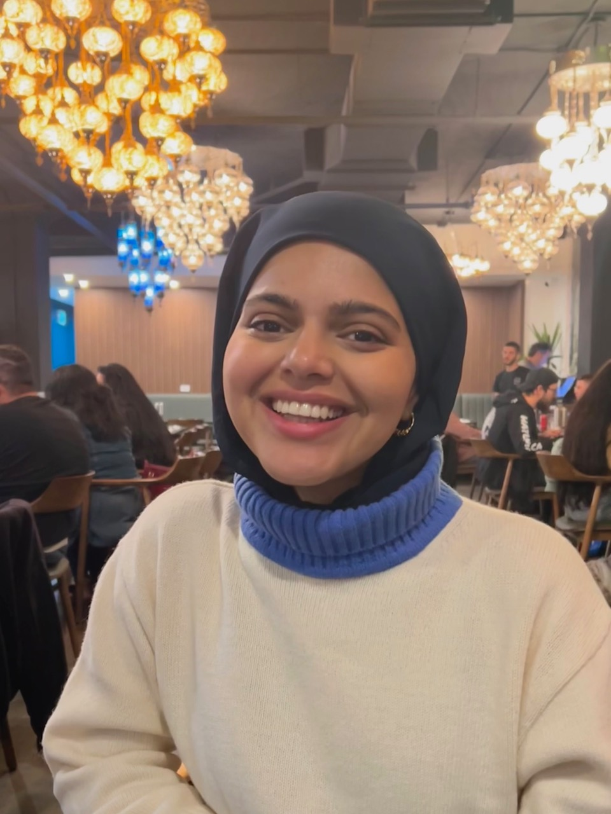
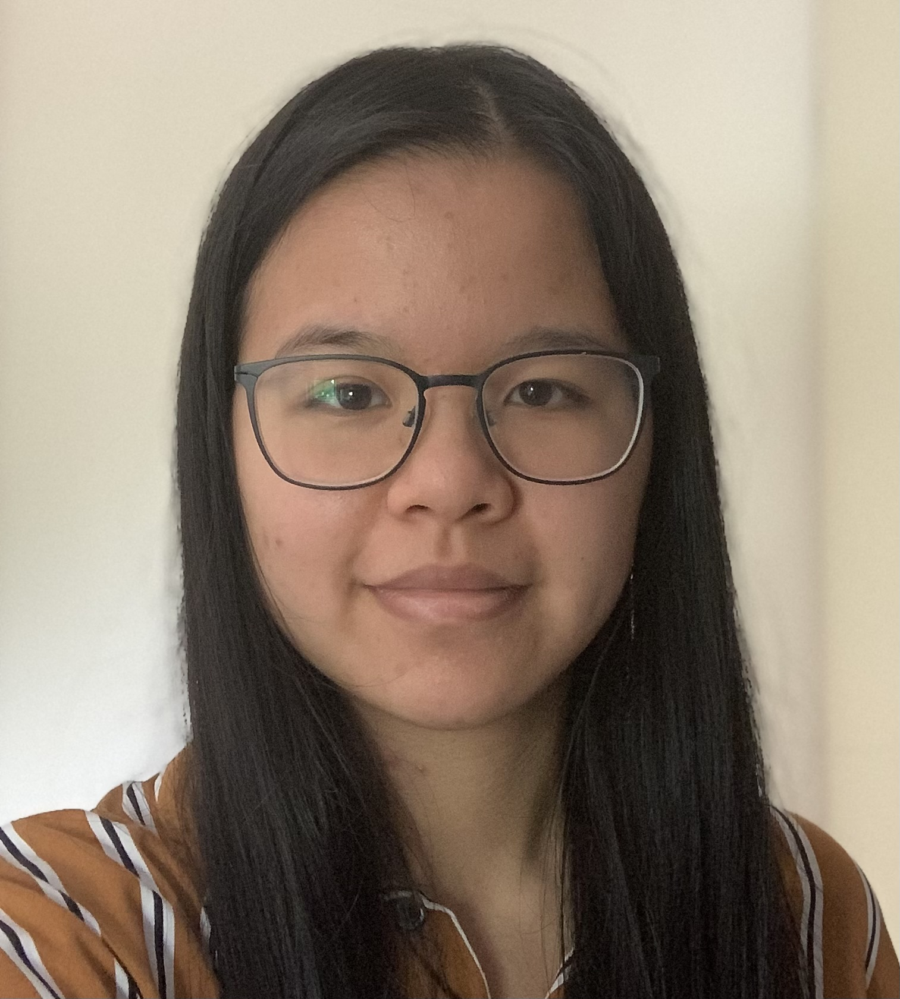
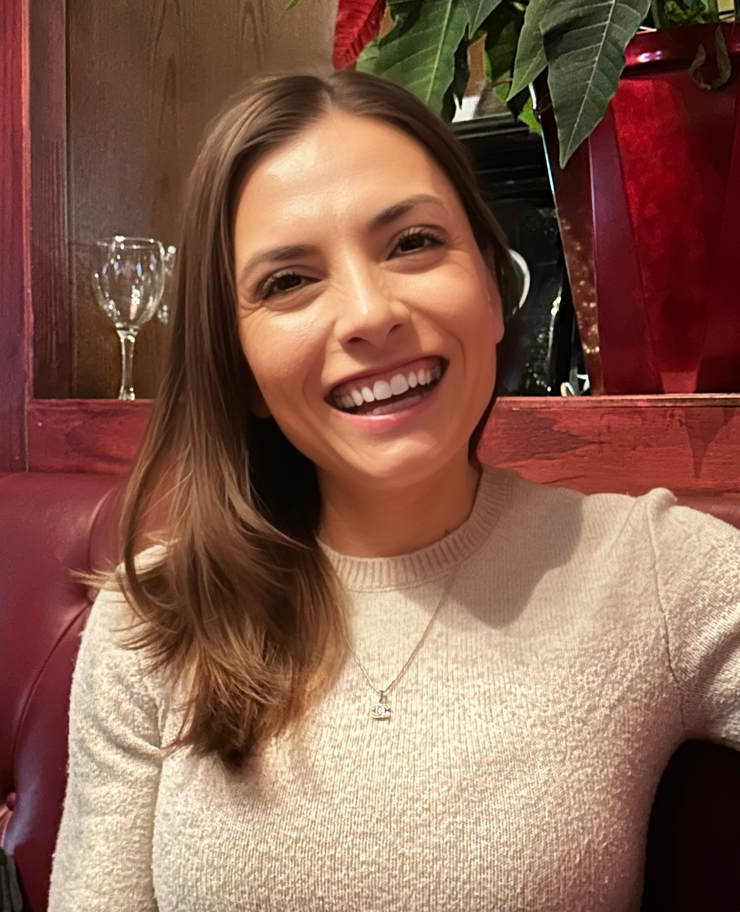
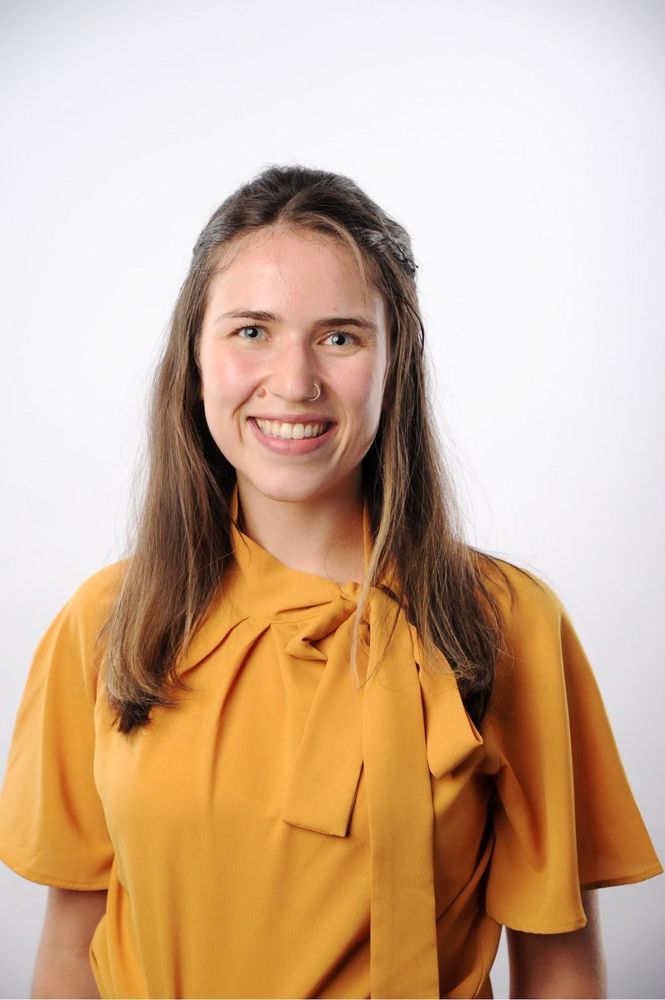
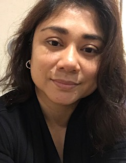
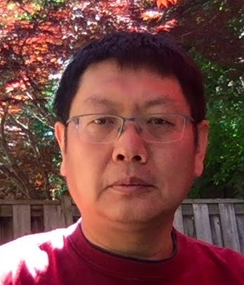

# Meet Your Faculty

### Shamini Ayyadhury

>Postdoctoral Fellow 
University of Toronto, University Health Network

Shamini Ayyadhury is a Postdoctoral Fellow with the University of Toronto and University Health Network. She is a computational biologist who works on a variety of spatial platforms and applies various methods for her analysis. She consults  on a wide range of spatial (and single cell) projects.

She currently serves as the Director of Panoramics and consults for various spatial projects.

### Amina Abow

>Research Technician 
Princess Margaret Genomics Centre

Amina is a Research Technician at the Princess Margaret Genomics Centre focusing on spatial transcriptomics assays, specifically the 10x Genomics assays Visium V2 and Visium HD. She completed her MSc. at the University of Toronto in the Laboratory Medicine and Pathobiology program.

### Jawairia Atif

Jawairia is a recent PhD graduate from the MacParland lab at the University of Toronto with expertise in single-cell and spatial transcriptomics in human liver biology and cancer

### Alyona Ivanova

>PhD Candidate 
Institute of Medical Sciences 
University of Toronto & Brain Tumour Research Department, the Hospital for Sick Children

### Joan Kant

>Bioinformatics Analyst 
Princess Margaret Cancer Centre

Joan obtained her BSc and MSc in Biomedical Engineering at Eindhoven University of Technology in The Netherlands. During her studies she became interested in using computational biology/bioinformatics to study cancer. In the Winter of 2022, she moved to Toronto for a 6-month internship in the Gaiti Lab studying cell-cell-communication in glioblastoma using scRNAseq. After her internship, she stayed on in the lab as a Bioinformatics Analyst. More recently, she started to dive into the world of spatial transcriptomics to further study cell-cell-communication.

### Dina Karamboulas

>Research Associate 
SickKids

Dina is a Research Associate with the Miller/Kaplan and Frankland/Josselyn labs at Sickkids. She completed her PhD at UBC in Anatomy & Cell Biology. Over the years she has developed skills in computational analysis using scRNA-seq, scATAC-seq, scMultiome-seq, Xenium and Merscope analysis to understand the molecular mechanisms involved in the developing and adult brain.

### Savannah Kilpatrick

>Scientist III, Cell Therapy 
Genentech, gRED

Savannah is a stem cell biologist passionate about 3D tissue generation and its applications to cell therapy. Her postdoctoral research at the University Health Network (Toronto, Canada) examined cell-type specific alterations in neural circuit development and cell migration using patient-derived brain organoids and assembloids. She paired this model system with spatial transcriptomics including the 10x Genomics Visium V2 and HD platforms, where she identified migratory and regionalized deficits in neural populations. 

### Melanie Peralta

>Laboratory Manager 
Mount Sinai

Melanie is a registered Medical Laboratory Technologist and member of CMLTO in good standing. She has over 25 years of experience in Histology; 3 years in diagnostic Histology (Dynacare and Mount Sinai) and was team lead for the Pathology research program at UHN for 22 years. She has recently changed roles and has returned to Mount Sinai as Laboratory Manager for Mount Sinai Services.

### Yiyan Wu

### Trevor Pugh

>Senior Scientist 
Princess Margaret Cancer Centre

Dr. Trevor Pugh is a Senior Investigator and the Director of Genomics at OICR. He leads the OICR Genomics program, which brings together the Princess Margaret Genomics Centre, OICR’s Genome Research Platform, Translational Genomics Laboratory and Genome Sequence Informatics teams under an integrated initiative to support basic, translational and clinical research.

### Gary Bader

>Professor 
University of Toronto
>
> [baderlab.org](http://baderlab.org)

Gary Bader is a Professor at The Donnelly Centre at the University of Toronto and an expert in Computational Biology. The Bader lab is developing computational methods and an ecosystem theory of tissue function that considers cell-cell interactions, cell growth, and cell internal mechanisms, such as pathways, reactions, and causal relationships, to help understand development, cancer and regenerative wound healing processes.

### Nia Hughes (she/her)

>Program Manager, Bioinformatics.ca 
Ontario Institute for Cancer Research
Toronto, ON, Canada
>
> --- nhughes@oicr.on.ca

Nia is the Program Manager for Bioinformatics.ca, where she coordinates the Canadian
Bioinformatics Workshop Series. Prior to starting at OICR, she completed her M.Sc. in
Bioinformatics from the University of Guelph in 2020 before working there as a
bioinformatician studying epigenetic and transcriptomic patterns across maize varieties.

### Zhibin Lu

>Senior Manager, Digital Research 
University Health Network 
Toronto, ON, Canada 
>
> --- zhibin@gmail.com

Zhibin Lu is a senior manager at University Health Network Digital. He is responsible for UHN
HPC operations and scientific software. He manages two HPC clusters at UHN, including
system administration, user management, and maintenance of bioinformatics tools for
HPC4Health. He is also skilled in Next-Gen sequence data analysis and has developed and
maintained bioinformatics pipelines at the Bioinformatics and HPC Core. He is a member of
the Digital Research Alliance of Canada Bioinformatics National Team and Scheduling
National Team.

# AWS setup instructions

### Course data downloads
Note that some of these files are quite large. If you have issues downloading them, try copying the link address, opening a new blank tab, and entering the URL into the new tab’s address bar. If that fails, contact us at info@bioinformatics.ca.

https://hpc4health.ca/cbw/2025/ISO-v/scripts_coursedata.zip  
https://hpc4health.ca/cbw/2025/ISO-v/data/ffpe_mouse_10x.tar  
https://hpc4health.ca/cbw/2025/ISO-v/data/frozen_mouse_10x.tar  
https://hpc4health.ca/cbw/2025/ISO-v/data/xenium_mouse_10x.tar  
https://hpc4health.ca/cbw/2025/ISO-v/data/subclass_celltype_label.csv  

### Amazon Machine Image

We have made our AWS AMI (Amazon Machine Image) publicly available. To launch your own instance, follow the [instructions provided by Amazon on how to launch an EC2 instance from a custom Amazon Machine Image](https://repost.aws/knowledge-center/launch-instance-custom-ami). Please note that you will need an AWS account to proceed, and that you will need to upload the CourseData files yourself.

Here are the details of the AMI:

AWS Region: us-east-1 (N. Virginia)  
AMI type: public image  
AMI name: CBW_ISO_250218  
AMI ID: ami-02bccaa393b482b4d  

If you want to create and activate a new AWS account, please follow [these instructions provided by Amazon](https://aws.amazon.com/premiumsupport/knowledge-center/create-and-activate-aws-account/).
